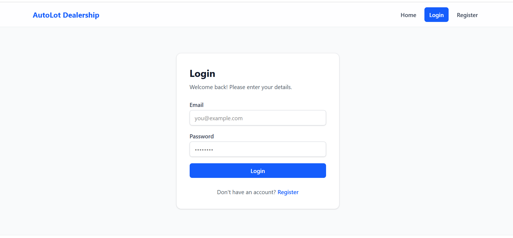
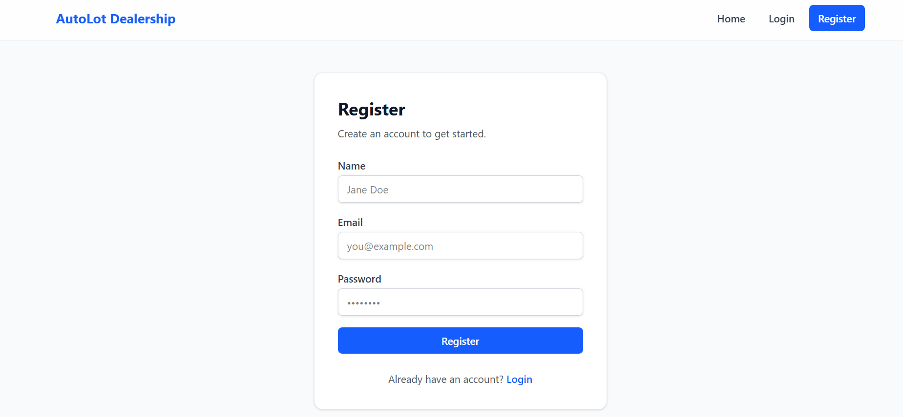
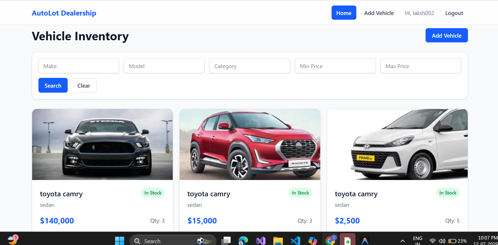
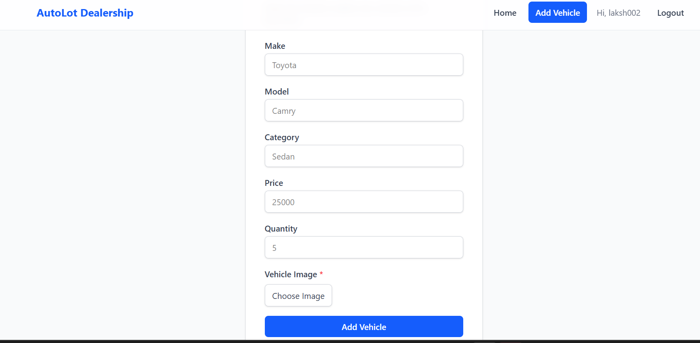
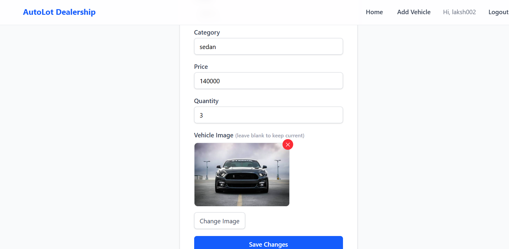

# 🚗 Car Dealership Inventory System

A full-stack web application for managing a car dealership's vehicle inventory. Built with **React 19 + Vite** on the frontend and **Express + MongoDB** on the backend, the system supports user authentication, owner-based vehicle listings, image uploads via Cloudinary, advanced search/filtering, pagination, purchasing, and restocking.

> **Live Repository:** [github.com/Lakshkyada/Car_Dealership_Inventory_System](https://github.com/Lakshkyada/Car_Dealership_Inventory_System)

---

## 📑 Table of Contents

- [Features](#-features)
- [Tech Stack](#-tech-stack)
- [Architecture Overview](#-architecture-overview)
- [Project Structure](#-project-structure)
- [Prerequisites](#-prerequisites)
- [Setup & Installation](#-setup--installation)
  - [1. Clone the Repository](#1-clone-the-repository)
  - [2. Backend Setup](#2-backend-setup)
  - [3. Frontend Setup](#3-frontend-setup)
- [Running the Application](#-running-the-application)
- [API Documentation](#-api-documentation)
- [Testing](#-testing)
  - [Running Tests](#running-tests)
  - [Test Report](#test-report)
- [Screenshots](#-screenshots)
- [My AI Usage](#-my-ai-usage)

---

## ✨ Features

| Feature | Description |
|---|---|
| **User Authentication** | JWT-based register & login with bcrypt-hashed passwords |
| **Owner-Based Authorization** | Only the creator of a listing can edit, delete, or restock it |
| **Vehicle CRUD** | Create, read, update, and delete vehicle listings |
| **Image Upload** | Vehicle images uploaded to Cloudinary with on-the-fly transformations |
| **Search & Filter** | Filter vehicles by make, model, category, and price range |
| **Pagination** | Server-side pagination with 9 vehicles per page |
| **Purchase Flow** | Any authenticated user can purchase available vehicles (decrements stock by 1) |
| **Restock Flow** | Owners can restock their vehicles with a custom quantity |
| **Responsive Design** | Fully responsive UI built with Tailwind CSS v4 |
| **Toast Notifications** | Real-time success/error feedback on all operations |
| **Confirmation Dialogs** | Delete actions require explicit confirmation |
| **Protected Routes** | Client-side route guards for authenticated and guest users |

---

## 🛠 Tech Stack

| Layer | Technologies |
|---|---|
| **Frontend** | React 19, Vite 8, React Router DOM, Axios, Tailwind CSS v4 |
| **Backend** | Node.js, Express 5, MongoDB, Mongoose 9, JWT, bcrypt |
| **Image Storage** | Cloudinary (with automatic image transformations) |
| **Testing** | Jest 30, Supertest, MongoDB Memory Server |
| **Dev Tools** | Nodemon, cross-env, OxLint |

---

## 🏗 Architecture Overview

```
┌─────────────────────────────┐         ┌──────────────────────────────────────┐
│        React Frontend       │  HTTP   │           Express Backend            │
│  (Vite Dev Server :5173)    │◄───────►│          (API Server :5000)          │
│                             │         │                                      │
│  • AuthProvider (Context)   │         │  Routes ─► Middleware ─► Controllers │
│  • Protected/Guest Routes   │         │                    │                 │
│  • Pages (Home, Login,      │         │              Mongoose Models         │
│    Register, Add/Edit)      │         │                    │                 │
│  • Components (VehicleCard, │         │              MongoDB Atlas /         │
│    SearchFilter, Modals)    │         │              Local MongoDB           │
│  • Axios API Layer          │         │                                      │
└─────────────────────────────┘         │         Cloudinary (Images)          │
                                        └──────────────────────────────────────┘
```

### Backend Architecture

```
server/
├── config/
│   ├── db.js                  # MongoDB connection setup
│   └── cloudinaryConfig.js    # Cloudinary SDK configuration
├── controllers/
│   ├── authController.js      # Register & login logic
│   ├── healthController.js    # Health check endpoint
│   └── vehicleController.js   # Full CRUD + purchase/restock
├── middleware/
│   ├── authMiddleware.js      # JWT verification & user attachment
│   └── uploadMiddleware.js    # Multer config for image uploads
├── models/
│   ├── userModel.js           # User schema (bcrypt pre-save hook)
│   └── vehicleModel.js        # Vehicle schema with owner ref
├── routes/
│   ├── authRoutes.js          # POST /api/auth/register, /login
│   ├── healthRoutes.js        # GET /health
│   └── vehicleRoutes.js       # All /api/vehicles/* routes
├── services/
│   ├── cloudinaryService.js   # Upload/delete image helpers
│   └── __mocks__/             # Jest mock for Cloudinary in tests
├── tests/
│   ├── auth.test.js           # Auth endpoint tests (7 tests)
│   ├── authMiddleware.test.js # Middleware unit tests (6 tests)
│   ├── health.test.js         # Health check test (1 test)
│   └── vehicle.test.js        # Vehicle API tests (69 tests)
├── app.js                     # Express app (middleware + routes)
├── server.js                  # Entry point (DB connect + listen)
└── jest.config.js             # Jest ESM config with mock mappings
```

### Frontend Architecture

```
client/src/
├── api/
│   ├── axiosInstance.js        # Axios instance with base URL & auth interceptor
│   ├── authApi.js              # Login/register API calls
│   └── vehicleApi.js           # All vehicle API calls
├── components/
│   ├── Button.jsx              # Reusable button component
│   ├── ConfirmDialog.jsx       # Modal confirmation dialog
│   ├── EmptyState.jsx          # Empty state placeholder
│   ├── ErrorState.jsx          # Error display with retry
│   ├── FormCard.jsx            # Styled form wrapper
│   ├── FormField.jsx           # Labeled input component
│   ├── Navbar.jsx              # Top navigation bar
│   ├── RestockModal.jsx        # Restock quantity modal
│   ├── ScrollToTop.jsx         # Scroll restoration on navigation
│   ├── SearchFilter.jsx        # Search/filter bar
│   ├── Spinner.jsx             # Loading spinner
│   ├── Toast.jsx               # Toast notification component
│   ├── VehicleCard.jsx         # Vehicle display card
│   ├── VehicleForm.jsx         # Add/Edit vehicle form
│   ├── useToast.js             # Toast custom hook
│   └── useRedirectToast.js     # Post-redirect toast hook
├── context/
│   ├── AuthContextInstance.js  # Auth context creation
│   ├── AuthProvider.jsx        # Auth state management
│   └── useAuth.js              # Auth context consumer hook
├── layouts/
│   └── MainLayout.jsx          # Main layout with Navbar
├── pages/
│   ├── Home.jsx                # Dashboard with vehicle grid
│   ├── Login.jsx               # Login form page
│   ├── Register.jsx            # Registration form page
│   ├── NotFound.jsx            # 404 page
│   └── vehicles/
│       ├── AddVehicle.jsx      # Add new vehicle page
│       └── EditVehicle.jsx     # Edit existing vehicle page
├── routes/
│   ├── AppRoutes.jsx           # Route definitions
│   ├── ProtectedRoute.jsx      # Auth-required route guard
│   └── GuestRoute.jsx          # Unauthenticated-only route guard
├── utils/                      # Shared utilities (formatting, validators, etc.)
├── App.jsx                     # Root component
└── main.jsx                    # React entry point
```

---

## 📋 Prerequisites

Before you begin, ensure you have the following installed:

- **Node.js** v18+ ([Download](https://nodejs.org/))
- **MongoDB** — either:
  - A local MongoDB instance ([Install Guide](https://www.mongodb.com/docs/manual/installation/)), or
  - A free [MongoDB Atlas](https://www.mongodb.com/cloud/atlas) cloud cluster
- **Cloudinary Account** (free) — for vehicle image hosting ([Sign Up](https://cloudinary.com/))
- **Git** ([Download](https://git-scm.com/))

---

## 🚀 Setup & Installation

### 1. Clone the Repository

```bash
git clone https://github.com/Lakshkyada/Car_Dealership_Inventory_System.git
cd Car_Dealership_Inventory_System
```

### 2. Backend Setup

```bash
# Navigate to the server directory
cd server

# Install dependencies
npm install

# Create your environment file from the template
cp .env.example .env
```

Now open `server/.env` and fill in your values:

```env
PORT=5000
MONGODB_URI=mongodb://127.0.0.1:27017/car_dealership
NODE_ENV=development
JWT_SECRET=your_jwt_secret_here          # Use a strong, random secret
CLIENT_URL=http://localhost:5173
CLOUDINARY_CLOUD_NAME=your_cloud_name    # From Cloudinary dashboard
CLOUDINARY_API_KEY=your_api_key          # From Cloudinary dashboard
CLOUDINARY_API_SECRET=your_api_secret    # From Cloudinary dashboard
```

> **💡 Tip:** Generate a secure JWT secret with: `node -e "console.log(require('crypto').randomBytes(64).toString('hex'))"`

### 3. Frontend Setup

```bash
# Navigate to the client directory (from project root)
cd client

# Install dependencies
npm install

# Create your environment file from the template
cp .env.example .env
```

Verify `client/.env` contains:

```env
VITE_API_BASE_URL=http://localhost:5000/api
```

---

## ▶ Running the Application

You need **two terminal windows** — one for the backend and one for the frontend.

**Terminal 1 — Start the Backend:**

```bash
cd server
npm run dev
```

Expected output:
```
Server running in development mode on port 5000
MongoDB Connected: 127.0.0.1
```

**Terminal 2 — Start the Frontend:**

```bash
cd client
npm run dev
```

Expected output:
```
VITE v8.x.x  ready in XXX ms

➜  Local:   http://localhost:5173/
```

**Open your browser** and navigate to `http://localhost:5173` to use the application.

### Quick Workflow

1. **Register** a new account at `/register`
2. **Login** with your credentials at `/login`
3. **Add vehicles** by clicking "Add Vehicle" on the dashboard
4. **Search & filter** vehicles using the search bar
5. **Purchase** vehicles listed by other users
6. **Edit / Delete / Restock** your own vehicle listings

---

## 📡 API Documentation

All API routes are prefixed with `/api` (except `/health`). Protected routes require a `Bearer <token>` in the `Authorization` header.

### Health Check

| Method | Endpoint | Auth | Description |
|--------|----------|------|-------------|
| `GET` | `/health` | ❌ | Server health check |

### Authentication

| Method | Endpoint | Auth | Description |
|--------|----------|------|-------------|
| `POST` | `/api/auth/register` | ❌ | Register a new user |
| `POST` | `/api/auth/login` | ❌ | Login and receive JWT token |

**Register Request Body:**
```json
{
  "name": "John Doe",
  "email": "john@example.com",
  "password": "password123"
}
```

**Login Response:**
```json
{
  "token": "eyJhbGciOi...",
  "user": {
    "_id": "...",
    "name": "John Doe",
    "email": "john@example.com",
    "role": "USER"
  }
}
```

### Vehicles

| Method | Endpoint | Auth | Description |
|--------|----------|------|-------------|
| `GET` | `/api/vehicles?page=1&limit=9` | ✅ | Get paginated vehicle list |
| `POST` | `/api/vehicles` | ✅ | Create a new vehicle (multipart form) |
| `GET` | `/api/vehicles/search` | ✅ | Search/filter vehicles |
| `PUT` | `/api/vehicles/:id` | ✅ 🔒 | Update a vehicle (owner only) |
| `DELETE` | `/api/vehicles/:id` | ✅ 🔒 | Delete a vehicle (owner only) |
| `POST` | `/api/vehicles/:id/purchase` | ✅ | Purchase a vehicle (decrements qty) |
| `POST` | `/api/vehicles/:id/restock` | ✅ 🔒 | Restock a vehicle (owner only) |

**Search Query Parameters:**
- `make` — Filter by vehicle make (case-insensitive, exact match)
- `model` — Filter by vehicle model
- `category` — Filter by category (e.g., Sedan, SUV, Coupe)
- `minPrice` — Minimum price
- `maxPrice` — Maximum price

**Example:** `GET /api/vehicles/search?make=Toyota&category=SUV&minPrice=30000`

---

## 🧪 Testing

The project includes a comprehensive test suite with **83 tests** across 4 test files, covering all API endpoints, authentication middleware, and edge cases.

### Running Tests

```bash
cd server
npm test
```

Tests use an **in-memory MongoDB instance** (`mongodb-memory-server`) so no external database is needed. Cloudinary calls are **mocked** via Jest `moduleNameMapper` to avoid external API calls during testing.

### Test Report

```
Test Suites: 4 passed, 4 total
Tests:       83 passed, 83 total
Snapshots:   0 total
Time:        33.582 s
```

#### Detailed Results

<details>
<summary><b>vehicle.test.js — 69 tests ✅</b></summary>

| Suite | Tests | Status |
|-------|-------|--------|
| **POST /api/vehicles** | 14 | ✅ All Passed |
| **GET /api/vehicles** | 7 | ✅ All Passed |
| **GET /api/vehicles (pagination)** | 8 | ✅ All Passed |
| **PUT /api/vehicles/:id** | 10 | ✅ All Passed |
| **DELETE /api/vehicles/:id** | 6 | ✅ All Passed |
| **GET /api/vehicles/search** | 13 | ✅ All Passed |
| **POST /api/vehicles/:id/purchase** | 4 | ✅ All Passed |
| **POST /api/vehicles/:id/restock** | 7 | ✅ All Passed |

**Key test areas:**
- Authentication guards (reject unauthenticated / invalid tokens)
- Owner-based authorization (403 for non-owners on edit/delete/restock)
- Input validation (missing fields, negative values, empty strings)
- Successful CRUD operations with correct response shapes
- Pagination logic (page clamping, limits, next/previous indicators)
- Search filtering by individual and combined parameters
- Edge cases (out-of-stock purchase, empty results, file type validation)

</details>

<details>
<summary><b>auth.test.js — 7 tests ✅</b></summary>

| Suite | Tests | Status |
|-------|-------|--------|
| **POST /api/auth/register** | 3 | ✅ All Passed |
| **POST /api/auth/login** | 4 | ✅ All Passed |

**Key test areas:**
- Successful registration with correct response (no password leak)
- Duplicate email rejection
- Missing required fields
- Successful login with JWT token
- Invalid email/password rejection
- Missing credentials handling

</details>

<details>
<summary><b>authMiddleware.test.js — 6 tests ✅</b></summary>

| Test | Status |
|------|--------|
| Missing Authorization header → 401 | ✅ |
| Missing Bearer scheme → 401 | ✅ |
| Invalid token → 401 | ✅ |
| Expired token → 401 | ✅ |
| Valid token but user not in DB → 401 | ✅ |
| Valid token → 200 + user attached | ✅ |

</details>

<details>
<summary><b>health.test.js — 1 test ✅</b></summary>

| Test | Status |
|------|--------|
| GET /health returns 200 + status OK | ✅ |

</details>

---

## 📸 Screenshots

> **Note:** Screenshots below show the application running locally with sample data.

### Login Page


### Register Page


### Home — Vehicle Inventory Dashboard


### Add Vehicle Form


### Edit Vehicle Form


---

## 🤖 My AI Usage

### Tools Used

- **Google Gemini (Antigravity IDE / AI Coding Assistant)** — Used as a pair-programming assistant throughout the project development.

### How AI Was Used

| Area | Usage |
|------|-------|
| **Project Scaffolding** | AI helped generate the initial project structure, including folder organization for both the server and client. |
| **Backend Development** | AI assisted with writing Express route handlers, Mongoose model schemas, JWT authentication middleware, and Cloudinary integration for image upload/delete. All generated code was reviewed, understood, and adjusted where needed. |
| **Frontend Development** | AI helped scaffold React components (VehicleCard, SearchFilter, RestockModal, etc.), set up React Router with protected routes, and implement the Axios API layer. Tailwind CSS styling was refined with AI suggestions. |
| **Test Suite** | AI helped write the comprehensive Jest + Supertest test suite (83 tests), including setting up MongoDB Memory Server for isolated testing and Jest module mocking for Cloudinary. |
| **Code Quality** | AI suggested input validation patterns, error handling strategies (e.g., distinguishing 400 vs 403 vs 404 vs 502), and defensive coding practices like non-negative price/quantity checks. |
| **Documentation** | AI assisted in writing this README including the API documentation, architecture overview, and project structure documentation. |
| **Debugging** | AI helped troubleshoot issues with ESM module imports in Jest, CORS configuration, multipart form data handling with Multer, and Mongoose validation edge cases. |

### My Contributions & Understanding

While AI was used as a development tool, I maintained full ownership and understanding of:

- **Architecture decisions** — Choosing Express + MongoDB + React + Vite as the tech stack, and designing the owner-based authorization model.
- **Data modeling** — Designing the User and Vehicle schemas with appropriate validation rules and relationships.
- **Business logic** — Implementing the purchase (decrement) and restock (increment) inventory flows with proper authorization guards.
- **Security** — Ensuring passwords are never returned in API responses, implementing JWT expiration, and adding owner-only checks.
- **Code review** — Every line of AI-generated code was reviewed, tested, and modified to fit the project requirements.

> **Disclaimer:** AI was used as a tool to accelerate development, not as a substitute for understanding. All code has been thoroughly reviewed and I can explain any part of the codebase.

---

## 📄 License

ISC
